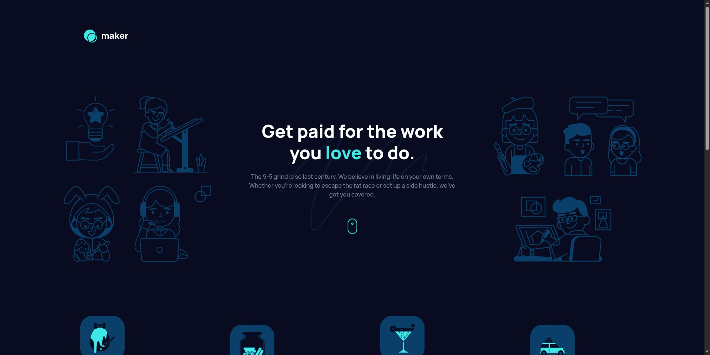

# Frontend Mentor - Maker pre-launch landing page solution

This is a solution to the [Maker pre-launch landing page challenge on Frontend Mentor](https://www.frontendmentor.io/challenges/maker-prelaunch-landing-page-WVZIJtKLd). Frontend Mentor challenges help you improve your coding skills by building realistic projects.

## Table of contents

- [Frontend Mentor - Maker pre-launch landing page solution](#frontend-mentor---maker-pre-launch-landing-page-solution)
  - [Table of contents](#table-of-contents)
  - [Overview](#overview)
    - [The challenge](#the-challenge)
    - [Screenshot](#screenshot)
    - [Links](#links)
  - [My process](#my-process)
    - [Built with](#built-with)
    - [What I learned](#what-i-learned)
      - [1. Responsive Design with Tailwind CSS](#1-responsive-design-with-tailwind-css)
      - [2. Custom Theme Configuration](#2-custom-theme-configuration)
      - [3. Form Validation with JavaScript](#3-form-validation-with-javascript)
      - [4. SVG Sprites](#4-svg-sprites)
      - [5. Accessibility Best Practices](#5-accessibility-best-practices)
      - [6. Accessibility and User Preferences](#6-accessibility-and-user-preferences)
    - [Continued development](#continued-development)
    - [Useful resources](#useful-resources)
    - [AI Collaboration](#ai-collaboration)
  - [Author](#author)
  - [Acknowledgments](#acknowledgments)

## Overview

### The challenge

Users should be able to:

- View the optimal layout depending on their device's screen size
- See hover states for interactive elements
- Receive an error message when the form is submitted if:
  - The `Email address` field is empty should show "Oops! Please add your email"
  - The email is not formatted correctly should show "Oops! That doesn't look like an email address"

### Screenshot



### Links

- Solution URL: [Add solution URL here](https://your-solution-url.com)
- Live Site URL: [Add live site URL here](https://your-live-site-url.com)

## My process

### Built with

- **Semantic HTML5 markup**
- **CSS custom properties**
- **Flexbox**
- **CSS Grid**
- **Mobile-first workflow**
- **[Tailwind CSS](https://tailwindcss.com/)** — utility-first CSS framework
- **Vanilla JavaScript** — form validation
- **SVG sprites** — icon optimization

### What I learned

Working on this project helped me deepen my understanding of several key areas:

#### 1. Responsive Design with Tailwind CSS

Using Tailwind's utility classes significantly simplified creating responsive layouts:

```html
<div
  class="flex flex-col items-center gap-8 md:flex-row md:gap-12 lg:max-w-63.75 lg:flex-col lg:items-start"
>
  <!-- Content -->
</div>
```

#### 2. Custom Theme Configuration

I configured Tailwind's theme to match the project's design system:

```css
@theme {
  --color-cyan-400: #3ee9e5;
  --color-neutral: #ffffff;
  --color-neutral-900: #080c20;
  --text-preset-1: clamp(2rem, 1.046rem + 4.071vw, 3rem);
}
```

#### 3. Form Validation with JavaScript

Implemented form validation with custom error messages and state management:

```javascript
const validationEmail = (email) => EMAIL_REGEX.test(email);

const setError = (message) => {
  errorMessage.textContent = message;
  errorMessage.classList.remove('opacity-0');
  errorMessage.classList.add('opacity-100');
  inputForm.setAttribute('aria-invalid', 'true');
};
```

#### 4. SVG Sprites

Used SVG sprites for icon optimization and better performance:

```html
<svg class="h-8.75 w-35">
  <use href="#logo"></use>
</svg>
```

#### 5. Accessibility Best Practices

- Used `aria-label` and `aria-labelledby` for screen readers
- Implemented `visually-hidden` class for semantic headings
- Managed focus states when errors occur
- Used `role="alert"` for error messages
- Added `aria-invalid` for input fields

#### 6. Accessibility and User Preferences

Added support for `prefers-reduced-motion` for users sensitive to motion:

```css
@media (prefers-reduced-motion: reduce) {
  *,
  *::before,
  *::after {
    animation-duration: 0.01ms !important;
    transition-duration: 0.01ms !important;
  }
}
```

### Continued development

In future projects, I plan to focus on:

1. **Performance optimization** — implementing lazy loading and critical CSS
2. **Advanced Tailwind** — creating custom plugins and advanced configurations
3. **Testing** — writing unit tests for JavaScript components
4. **TypeScript** — transitioning to TypeScript for better type safety
5. **Animations** — using CSS animations to enhance UX

### Useful resources

- [Tailwind CSS Documentation](https://tailwindcss.com/docs) — The main documentation that helped configure custom themes and utilities
- [MDN Web Docs - Form Validation](https://developer.mozilla.org/en-US/docs/Learn/Forms/Form_validation) — Excellent guide on form validation
- [CSS-Tricks - A Complete Guide to Flexbox](https://css-tricks.com/snippets/css/a-guide-to-flexbox/) — Helped understand Flexbox layouts
- [Frontend Mentor Community](https://www.frontendmentor.io/community) — Community where you can find solutions and discussions

### AI Collaboration

I used the following AI tools during development:

- **GitHub Copilot** — Assisted with autocomplete, especially when writing Tailwind classes and repetitive structures
- **ChatGPT** — Used for:
  - Explaining complex CSS concepts
  - Refactoring JavaScript code for form validation
  - Generating regex patterns for email validation
  - Reviewing semantic HTML markup

**What worked well:**

- Quick generation of boilerplate code
- Clear explanations of unfamiliar technologies
- Alternative approaches to problem-solving

**What didn't work as well:**

- Sometimes suggested over-engineered solutions
- Required verification of code against project specifications

## Author

- GitHub - [@runny-life](https://github.com/runny-life)
- Frontend Mentor - [@runny-life](https://www.frontendmentor.io/profile/runny-life)

## Acknowledgments

This project was completed as a solution to the Frontend Mentor challenge. Special thanks to the Frontend Mentor community for providing feedback and inspiration. The design and assets were provided by Frontend Mentor.
